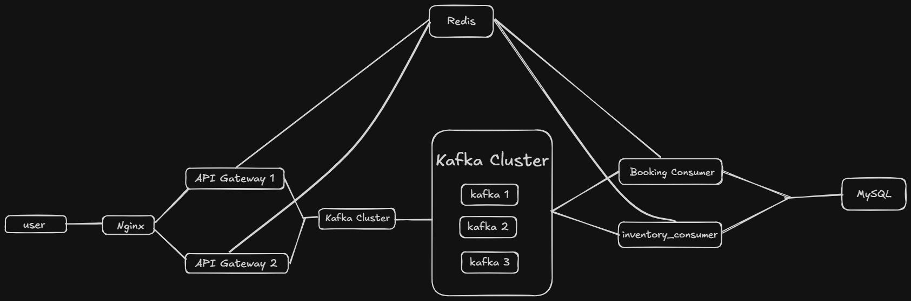

# 🎟️ Ticket Booking System
 
A high-throughput, distributed ticket booking system designed to handle **100,000+ requests per second** with strong consistency guarantees. Built with Go, Kafka, Redis, and MySQL — fully containerised with Docker Compose.
 
---
 
## Architecture
 

 
**Request flow:**
1. Nginx load-balances across two API Gateway instances (`least_conn`)
2. Gateway authenticates the JWT, enforces per-IP rate limiting, then performs an **atomic Redis decrement** — the single availability gate
3. On success, the booking event is published to Kafka (`booking.requests`, 12 partitions)
4. Gateway returns `202 Accepted` immediately; client polls `/api/booking/status/:key`
5. **Booking Consumer** (32 workers) consumes the event, writes to MySQL, caches the result for polling, then publishes to `inventory.sync`
6. **Inventory Consumer** updates the `tickets.available` counter in MySQL asynchronously
 
**Redis is used by:** API Gateway 1, API Gateway 2, Booking Consumer  
**Redis is NOT used by:** Inventory Consumer (MySQL-only)
 
---
 
## Key Design Decisions
 
| Concern | Solution |
|---|---|
| Overselling prevention | Atomic Lua script `DECRBY` on Redis counter — O(1), single gate |
| Duplicate requests | Idempotency keys with 24 h TTL stored in Redis |
| Kafka redelivery safety | Consumer checks idempotency cache before DB write |
| Kafka publish failure | Compensating `AtomicRelease` rolls back the Redis decrement |
| Ordering per user | Messages keyed by idempotency key → same partition |
| DB inventory drift | `inventory.sync` topic keeps MySQL in sync asynchronously |
| Dead letters | Unparseable messages routed to `booking.dlq` (3 partitions) |
| Rate limiting | Sliding-window sorted-set Lua script per IP in Redis |
 
---
 
## Services
 
| Service | Image / Language | Port | Role |
|---|---|---|---|
| `nginx` | `nginx:alpine` | `8080` | Reverse proxy, load balancer |
| `api_gateway_1/2` | Go (Gin) | internal `8080` | Auth, rate limit, Kafka producer |
| `booking_consumer_1` | Go | — | Booking writes, idempotency, inventory trigger |
| `inventory_consumer_1` | Go | — | MySQL `tickets.available` sync |
| `kafka1/2/3` | `confluentinc/cp-kafka:7.6.0` | `9092/9093` | KRaft cluster (no Zookeeper) |
| `redis` | `redis:7-alpine` | `6379` | Counter, rate limit, idempotency cache |
| `mysql` | `mysql:8.0` | `3307→3306` | Persistent booking + inventory store |
 
---
 
## Kafka Topics
 
| Topic | Partitions | Replication | Purpose |
|---|---|---|---|
| `booking.requests` | 12 | 3 | Gateway → Booking Consumer |
| `booking.results` | 12 | 3 | Booking Consumer → polling cache |
| `inventory.sync` | 6 | 3 | Booking Consumer → Inventory Consumer |
| `booking.dlq` | 3 | 3 | Unparseable / permanently failed messages |
 
Replication factor 3, `min.insync.replicas = 2` — tolerates one broker failure without data loss.
 
---
 
## Getting Started
 
### Prerequisites
 
- Docker ≥ 24 and Docker Compose v2
- Go 1.22+ (for local development only)
 
### Environment
 
Create a `.env` file in the project root:
 
```env
JWT_SECRET=your-super-secret-key-here
TICKETS_INITIAL_COUNT=100
```
 
### Run
 
```bash
docker compose up --build
```
 
The stack takes ~30 s to fully healthy. Kafka brokers perform leader election and the API gateways retry topic creation in the background.
 
### Verify
 
```bash
# Health check
curl http://localhost:8080/health
 
# Book a ticket (requires a valid JWT)
curl -X POST http://localhost:8080/api/book \
  -H "Authorization: Bearer <token>" \
  -H "Content-Type: application/json" \
  -d '{"name": "Alice", "idempotency_key": "order-001"}'
 
# Poll for result
curl http://localhost:8080/api/booking/status/order-001 \
  -H "Authorization: Bearer <token>"
```
 
**Response on booking:**
```json
{
  "message": "booking queued",
  "idempotency_key": "order-001",
  "poll_url": "/api/booking/status/order-001"
}
```
 
**Response on status (once processed):**
```json
{
  "idempotency_key": "order-001",
  "booking_id": 42,
  "name": "Alice",
  "status": "success"
}
```
 
---
 
## Project Structure
 
```
.
├── api-gateway/
│   ├── handlers/        # BookTicket, BookingStatus
│   ├── middleware/       # Auth (JWT), Logger (trace ID), RateLimit (sliding window)
│   ├── routes/
│   └── main.go
├── booking-consumer/
│   ├── worker/          # ProcessBooking — DB write, idempotency, inventory publish
│   └── main.go
├── inventory-consumer/
│   └── main.go          # processInventory — MySQL available counter sync
├── shared/
│   ├── cache/           # Redis client, AtomicReserve/Release, idempotency helpers
│   └── kafka/           # Producer, consumer pool, topic definitions, DLQ
├── mysql/
│   └── init.sql
├── nginx/
│   └── nginx.conf
└── docker-compose.yml
```
 
---
 
## API Reference
 
### `POST /api/book`
 
Requires `Authorization: Bearer <jwt>`.
 
| Field | Type | Required | Description |
|---|---|---|---|
| `name` | string | ✓ | Ticket holder name |
| `idempotency_key` | string | — | Client-generated key for deduplication. Auto-generated if omitted. |
 
**Responses:**
 
| Status | Meaning |
|---|---|
| `202 Accepted` | Booking queued successfully |
| `400 Bad Request` | Missing required fields |
| `401 Unauthorized` | Missing or invalid JWT |
| `409 Conflict` | No tickets available |
| `429 Too Many Requests` | Rate limit exceeded |
| `503 Service Unavailable` | Redis unavailable (fail-safe, not failing open) |
 
### `GET /api/booking/status/:key`
 
Requires `Authorization: Bearer <jwt>`.
 
| Status | Meaning |
|---|---|
| `200 OK` | Booking processed — body contains result |
| `202 Accepted` | Still pending (`{"status": "pending"}`) |
 
---
 
## Configuration
 
| Variable | Default | Description |
|---|---|---|
| `JWT_SECRET` | — | **Required.** HMAC secret for JWT validation |
| `TICKETS_INITIAL_COUNT` | `100` | Seed value for Redis ticket counter on startup |
| `KAFKA_BROKERS` | `kafka1:9092,...` | Comma-separated broker list |
| `REDIS_ADDR` | `redis:6379` | Redis address |
| `KAFKA_WORKERS` | `32` | Booking consumer worker goroutines |
| `GIN_MODE` | — | Set to `release` to suppress debug logs |
| `PORT` | `8080` | API Gateway listen port |
 
---
 
## Observability
 
Every request through the gateway is tagged with a `X-Trace-ID` UUID (set by the Logger middleware and echoed in the response header). Logs follow the format:
 
```
[GATEWAY] trace=<uuid> method=POST path=/api/book status=202 latency=1.2ms ip=10.0.0.1
```
 
To stream booking consumer logs:
 
```bash
docker compose logs -f booking_consumer_1
```
 
---
 
## Durability Guarantees
 
- **`RequiredAcks: RequireOne`** — leader acknowledgment before returning from `Publish`. Upgrade to `RequireAll` for stricter at-least-once at the cost of latency.
- **`KAFKA_MIN_INSYNC_REPLICAS: 2`** — writes rejected unless 2 of 3 replicas are in sync.
- **`KAFKA_TRANSACTION_STATE_LOG_MIN_ISR: 2`** — transactional offset commits require quorum.
- **Compensating transaction** — if Kafka publish fails after Redis decrement, `AtomicRelease` is called immediately to prevent phantom sold tickets.
- **Consumer idempotency** — booking consumer checks Redis before every DB write, making Kafka redelivery safe.
 
---
 
## Development
 
### Run a single service locally
 
```bash
# Start dependencies only
docker compose up kafka1 kafka2 kafka3 redis mysql
 
# Run the gateway locally
cd api-gateway
KAFKA_BROKERS=localhost:9092 REDIS_ADDR=localhost:6379 JWT_SECRET=dev go run main.go
```
 
### Rebuild after code changes
 
```bash
docker compose up --build api_gateway_1 api_gateway_2
```
 
---
